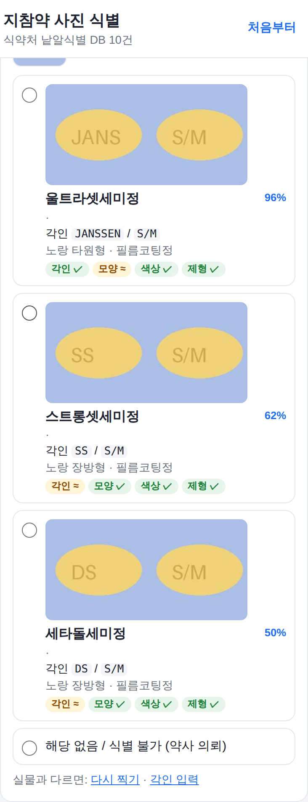

# 지참약 사진 식별 보조 (프로토타입)

입원 환자가 가져온 알약을 사진으로 찍으면, **각인·모양·색·제형**을 읽어서
**식약처 의약품 낱알식별 DB**와 대조한 후보 약을 보여 주는 웹앱입니다.

> ⚠️ 의료기기가 아닌 **보조 도구**입니다. 결과는 후보일 뿐이며, 실물과 대조한 뒤
> 약사와 함께 최종 확인해야 합니다. 원내 도입 전 정보보안·약제부 검토가 필요합니다.

## 동작 방식

1. 사진 촬영 (휴대폰 카메라 바로 사용 가능, 여러 장 가능)
2. Claude 비전이 알약마다 **외형 특징만** 추출 — 약 이름은 추측하지 않도록 설계
3. 추출한 각인/모양/색을 로컬 낱알식별 DB에서 검색 → 후보 목록 + 식약처 공식 이미지
4. 사진 판독만으로 확정하기 어려우면 그 알약 카드에 보조 수단이 뜹니다
   - 각인이 안 읽힘 / 후보 없음 / 비슷한 후보 여러 개 / 각인 일부 불확실
   - **📷 이 알약만 다시 찍기**: 해당 알약의 앞·뒷면을 찍으면 그 카드만 다시 분석
   - **⌨️ 각인 입력**: 사진 판독 값이 미리 채워진 칸을 고쳐서 검색 (외부 전송 없이 로컬 DB만 사용)
   - 결과가 명확해도 카드 아래 작은 링크로 언제든 같은 기능을 쓸 수 있습니다
5. 간호사가 알약마다 후보를 고르거나 "식별 불가(약사 의뢰)"로 표시 → 확인 목록 인쇄

정확도를 위해 AI는 사진을 최대 해상도(긴 변 2576px)로 받고, 알약마다 **확대(zoom) 도구**를 써서
각인을 다시 읽습니다. 확대할 때는 흰 알약의 얕은 음각이 보이도록 **흑백 대비 강조본**도 함께 봅니다.
DB 대조는 각인 일치를 가장 크게 보고, 사진으로 헷갈리기 쉬운 모양(타원형↔장방형)·색(분홍↔주황 등)은
'근접(≈)'으로 따로 표시합니다.

AI가 약 이름을 직접 말하게 하지 않고 공공 DB 대조로만 후보를 만드는 이유는,
모델의 기억에 의존한 약명은 검증할 수 없고 틀렸을 때 위험하기 때문입니다.
각인이 안 보이면 모양·색만으로는 특정이 불가능하다는 경고를 띄웁니다.



## 실행

```bash
python -m venv .venv && source .venv/bin/activate
pip install -r requirements.txt

# 1) 낱알식별 DB 받기 — 셋 중 하나
DATA_GO_KR_KEY=발급받은키 python scripts/sync_mfds.py api   # 공공데이터포털 Open API
python scripts/sync_mfds.py csv 낱알식별목록.csv              # 내려받은 CSV 파일
python scripts/sync_mfds.py demo                              # 가상의 데모 약 5개 (화면 확인용)

# 2) 서버 실행
export ANTHROPIC_API_KEY=...
uvicorn app.main:app --host 0.0.0.0 --port 8000
```

브라우저에서 `http://<서버주소>:8000` 접속. 휴대폰 카메라를 쓰려면 HTTPS가 필요할 수 있습니다.

- 공공데이터포털에서 **「식품의약품안전처_의약품 낱알식별 정보」** 활용신청 → 일반 인증키 발급.
- DB는 월 1회 정도 다시 동기화하면 신규 품목이 반영됩니다.

## 휴대폰(데이터)으로 쓰기 — Render에 배포

와이파이 없이 LTE/5G로 어디서든 쓰려면 인터넷에 올려서 고정 주소(https)를 만듭니다.
저장소 루트의 `render.yaml`에 설정이 들어 있습니다.

1. [render.com](https://render.com) 가입 (GitHub 계정으로 로그인)
2. 대시보드 → **New → Blueprint** → 이 저장소(`thoughts`) 선택
3. 환경변수 3개 입력
   - `ANTHROPIC_API_KEY`: `sk-ant-...`
   - `DATA_GO_KR_KEY`: 공공데이터포털 **Decoding** 인증키
   - `APP_PASSWORD`: 접속 비밀번호 (길고 추측하기 어렵게)
4. **Apply** → 빌드 중에 식약처 DB를 자동으로 받습니다 (몇 분)
5. 완료되면 `https://pill-identifier-xxxx.onrender.com` 주소가 생깁니다
6. 휴대폰에서 열기 → 로그인 창에서 아이디는 아무거나, 비밀번호는 `APP_PASSWORD`
   → 홈 화면에 추가해 두면 앱처럼 쓸 수 있습니다

- 무료 요금제는 15분간 안 쓰면 잠들어서, 다음에 처음 열 때 30초~1분 걸립니다.
- 식약처 DB는 배포할 때마다 새로 받습니다. 대시보드에서 **Manual Deploy**를 누르면 최신화됩니다.
- 비밀번호를 10번 틀리면 해당 기기는 10분간 잠깁니다.

## 개인정보·보안

- 사진은 서버에 저장하지 않고 메모리에서만 처리하며, 분석을 위해 Anthropic API로 전송됩니다.
  환자 이름·등록번호·약봉투 라벨이 찍히지 않게 촬영하세요.
- 원내 사용 시 외부 API 전송에 대한 기관 승인(개인정보보호, 정보보안)을 먼저 받으세요.
- 인터넷에 올릴 때는 반드시 `APP_PASSWORD`를 설정하세요. 없으면 누구나 접속해 API 요금을 쓸 수 있습니다.

## 한계

- 각인 없는 약, 마크(로고)만 있는 약, 반으로 쪼갠 약, 가루약·조제약(포장지 개봉분)은 식별이 어렵습니다.
- 해외 약·건강기능식품은 식약처 DB에 없습니다.
- 흰색 원형 정제는 수백 종이 비슷하므로 **각인 판독이 핵심**입니다. 재촬영을 아끼지 마세요.

## 테스트

```bash
pytest -q
```
